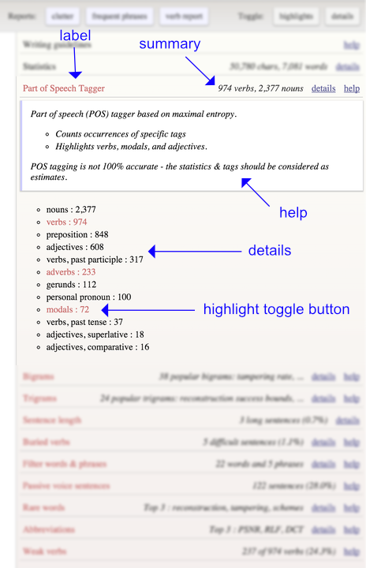

# scientific writing toolkit

Scientific writing toolkit (SWTK) is a LaTeX manuscript analysis tool that facilitates clear writing (in English).


@ 2015 [Paweł Korus](https://github.com/pkorus)

## Introduction

Scientific writing toolkit (SWTK) is a Python-based scientific manuscript analysis tool that facilitates clear writing. It detects common problems with English writing like overuse of weak verbs, or excessive use of adverbs, and passive voice, etc.

SWTK generates a self-contained interactive HTML report with appropriate highlights in the text. An example report can be downloaded [here](https://github.com/swtk/examples/report.html). This report uses the default template; you can customize the CSS template to your liking. 

I designed the toolkit with LaTeX manuscripts in mind; you can expect equations and citations alike to get out of your way while proofreading. Since I did not intended to implement a full fledged TeX parser; there are some [basic guidelines](#preparing-your-manuscript) that you should follow for best results. You can easily integrate SWTK in your document [compilation workflow](#workflow-integration). If you wish (or if the included LaTeX parser does not work for you) you can use either Markdown or plaintext documents.

Text analysis relies on the [Natural Language Processing Toolkit](http://www.nltk.org/). A full list of currently available analysis modules is featured [below](#available-analysis-tools). If you do not see what you need - let me know or just add it yourself - the toolkit can be easily extended with [plug-ins](#plug-in-development). For more information on the principles of good writing, you can refer to the classic book [The Elements of Style](http://www.gutenberg.org/ebooks/37134), or one of the available MOOCs out there (see examples below).

This project was inspired by two online apps: [Hemingway](http://www.hemingwayapp.com/) and [Expresso](http://www.expresso-app.org). Both are online editors, intended for general-purpose writing, and as such did not suit my LaTeX writing workflow well.

**Learn More:**

- The Elements of Style (book), [http://www.gutenberg.org/ebooks/37134](http://www.gutenberg.org/ebooks/37134)
- Writing in the Sciences (MOOC), [https://www.coursera.org/course/sciwrite](https://www.coursera.org/course/sciwrite)
- Academic English: Writing (MOOC), [https://www.coursera.org/specializations/academic-english](https://www.coursera.org/specializations/academic-english)

**Alternatives:**

- [http://www.hemingwayapp.com/](http://www.hemingwayapp.com/)
- [http://www.expresso-app.org](http://www.expresso-app.org)

**Libraries**

- [jQuery](https://jquery.com/)
- [MathJax](https://www.mathjax.org/)
- [Natural Language Processing Toolkit](http://www.nltk.org/)

## License

The toolkit is published under the [MIT License](http://www.opensource.org/licenses/mit-license.php). This means it is provided free of charge, but without warranties of any kind.

## Installation

Get a copy: download the latest version as a [ZIP archive](https://github.com/pkorus/swtk/archive/master.zip) or clone the repository:

```bash
> git clone https://github.com/pkorus/swtk.git
```

Install the [natural language processing toolkit](http://www.nltk.org/install.html) (you'll need Python 2.7 first):

```bash
> sudo pip install -U nltk
```

Install the required [nltk packages](http://www.nltk.org/data.html):

- Punkt Tokenizer Models
- Maximal Entropy Treebank POS tagger
- Averaged Perceptron Tagger (depending on the version of NLTK)

``` bash
> python -m nltk.downloader punkt
> python -m nltk.downloader maxent_treebank_pos_tagger
> python -m nltk.downloader averaged_perceptron_tagger
```

SWTK uses the default POS tagger from NLTK. This guarantees that you are using the recommended tagging engine, but might change accross different versions of NLTK. Note that the taggers might differ not only in the classification accuracy, but also in processing time, e.g., the Maximal Entropy Treebank POS tagger is significantly faster than the Averaged Perceptron Tagger. If the default tagger does not work for you, consider switching to a [different one](http://www.nltk.org/book/ch05.html).

## Usage

The toolkit is intended for command line usage. If you prefer something more automatic, see the notes below on integration with a typical document compilation workflow. For a full list of command line options, run the `swtk-analyzer` with argument `--help`.

### Basic usage

```bash
> python swtk-analyzer.py [options] filename.(tex|md|txt)
```

Most important arguments:

Command Line Option | Description
--------------------|------------
`-o filename.html`  | output filename; use `-` for stdout
`-e`/`--external`   | externalize css / javascript, by default, they are embedded in the document
`-f`/`--floats`     | enable floats - also extract and check captions of figures and tables
`-m`/`--math`       | enables experimental math support

### Customization

The appearance of the report and the user interface is defined by a CSS stylesheet (`./data/default.css`). You can customize it directly, or supply a different one via command line options (`-s`). You can also hack your way into the report behavior (`./data/default.js` or `-j`).

### Workflow Integration

Integration with **Kile**

Integration with **latexmk**

## Preparing your Manuscript

The toolkit is designed for working with technical documents written in LaTeX; commonly used special tokens (references, citations, equations, etc.) will be replaced with stubs, e.g., `\cite{label}` will become `[1]`. Equations can be optionally rendered in the text using MathJax - refer to [command line options](#usage) for more details.

### LaTeX

The toolkit implements a rudimentary LaTeX parser. Do not expect it to handle complicated documents with custom commands. If the included parser does not work for you, consider using Markdown or plaintext (see below).

The following things should generally work:

- document title (`\title{}`)
- authors (`\author{}` or `\name{}`)
- abstract (`\begin{abstract}...\end{abstract}]`)
- sections (`\section{}`, `\subsection{}`, etc.)
- paragraphs
- captions of floats (`\begin{figure}` and `\begin{table}`) - enabled separately via command line options
- not-nested enumerations (`\begin{itemize}` and `\begin{enumerate}`)
- getting rid of citations, references, and text formatting commands (`emph, textbf, text`)

Possibly important ignored items include:

- other environments (e.g., `center`, `algorithm`)
- document inclusion commands (e.g., `input` or `include`)
- clustered commands; the parser treats consecutive non-empty lines as a single block and parses only the first command.

E.g., from the following snippet:

```latex
\section{Introduction}
\label{sec:introduction}
```

only the first command (`section`) will be parsed. Make sure to separate important commands with an empty line, e.g.,

```latex
\appendices

\section{}
```

**Math support** is experimental. If enabled, the HTML will reference to MathJax via CDN, so Internet connectivity will be required to view the math in the reports.

Inline equations should be enclosed with `$` (single dollar sign). Separate equations should be enclosed with `\begin{equation}` or `begin{equation*}`. Do not expect more complex equations to render properly (e.g., when using the `\begin{cases}` environment) - unless a future update of MathJax fixes this.


### Markdown

The toolkit implements a rudimentary Markdown parser:

- lines starting with `#{1,5} ` will be converted to section titles;
- a block of lines starting with `- ` or a number (`[0-9]+\. `) will be interpreted as an enumeration (nested enums are not supported);
- format strings will be removed (`_`, `**` and `*`);
- inline code will be replaced with `[code]`;
- links will be replaced with link name;

Other content - e.g., images, tables, code blocks - is currently not supported, and should not be present in the analyzed document.

### Plaintext

Plaintext is the simplest option available. One-line paragraphs without a period will be treated as section titles (only top level). Block of lines starting with `- ` will be treated as an enumeration. Everything else will be treated as raw text.

### Other Formats

Other formats are not supported. If you wish, you may implement the necessary parser yourself, or use a document conversion tool, e.g., [Pandoc](http://pandoc.org/).

## Available Analysis Tools

Analysis Tool                  | Status | Description
-------------------------------|--------|-------------------------------------
Basic document statistics      | stable | basic stats like character / word count, etc.
Part of speech statistics      | stable, needs improvement | the number of verbs, nouns, modals, adverbs, etc.
Extra long and short sentences | stable |
Weak verbs                     | stable | weak overused verbs, e.g., is, has, does
Filter words & phrases         | stable | vague words and phrases used typically in spoken language
Passive voice                  | stable | self-explanatory
Buried verbs                   | prototype | finds verbs that are too far from the subject
Negative statements            | -      |
Frequent bigrams               | stable | frequently used pairs of words
Frequent trigrams              | stable | frequently used triples of words
Frequent abbreviations         | stable | frequently used abbreviations
Overuse of rare words          | prototype |
Verbs used as weird nouns      | -      |
Sentence difficulty estimation | -      |

### Useful Resources

- POS table, [http://www.monlp.com/2011/11/08/part-of-speech-tags/](http://www.monlp.com/2011/11/08/part-of-speech-tags/)

## Plug-in Development

The toolkit provides a simple plug-in architecture. All you need to do is to derive a new class from `Plugin` and provide suitable processing methods:

- `process_text(self, paper)`
- `process_token(self, token)`
- `process_sentence(self, sentence)`

These methods give you access to the paper, token, and sentence objects, respectively. Obviously, you can access the sentences and tokens from the `process_text` method - the remaining two are just for convenience. Once you're done with processing individual tokens/sentences, you need to finish your work in the `finalize(self, paper)` method - called in the end by the plugin manager. It is responsible for generating the final report of your analysis (should be appended to the `paper.reports` list).

An example report for the POS tagger plugin is shown below:



The final report is represented by the `Report` class which contains the following attributes:

Attribute   | Description
------------|------------------------
`label`       | human readable name for your report.
`details`     | the main content of your report (HTML text): use a `list` to have its items automatically wrapped in an `<ul>` tag (unordered list); use a `string` to directly specify the HTML of your report.
`help`        | a short note about what your plugin does (optional); string with HTML content.
`summary`     | a short information that summarizes the main results of your plugin; use a string; make it as compact as possible.
`css_classes` | list of all css classes that your plugin has used; this list is used for two purposes: to generate a "toggle all" button (for your plugin's label), and to generate css classes in the HTML code; the list can contain either a dedicated `CSS` object (basically a name and color specification) or a string (in this case, the toolkit will generate the highlight colors automatically). The first option gives you the flexibility to change highlight colors dynamically (see the bigrams plugin for an example).

### Highlighting items

In order to highlight selected words or sentences, just append the css class name to the `reports` list (attribute of both `Sentence` and `Token`) classes. The system uses a convention that classes beginning with an underscore (`_`) are disabled. This will be automatically handled by the toolkit - you just need to make sure that your initial assignment is correct, e.g., append class name `_weakVerb` if you want the highlight to be disabled by default, otherwise append `weakVerb`. When reporting the classes to the toolkit (the `css_classes` attribute of your report) use class names without the beginning underscore (i.e., report `weakVerb` in the previous example).

### Generating Individual Highlight Toggle Buttons

By default, the toolkit will provide a toggle button for turning on/off the highlights made by individual plugins (once the `css_classes` attribute is set in the report). Toggling individual highlights is also supported, but requires explicit instructions. When generating the string list with report details, use `Plugin.toggle_button_generator` to wrap the list items in the necessary HTML code. The method expects a tuple with the item text, and a corresponding CSS class that should be toggled.

A brief example:

```python
# Example output of text analysis
reportItems = [('word_1',10), ('word_2',8)]
css_mapping = {'word_1': 'cssClass1', 'word_2': 'cssClass2'}

# Report generation (core of the finalize method)
detailedReport = [('{} : {}'.format(k,v), css_mapping[k]) for (k,v) in reportItems]
report = Report('Rare words', Plugin.toggleButtonGenerator(detailedReport))
report.css_classes = css_mapping.values()
paper.reports.append(report)

```
